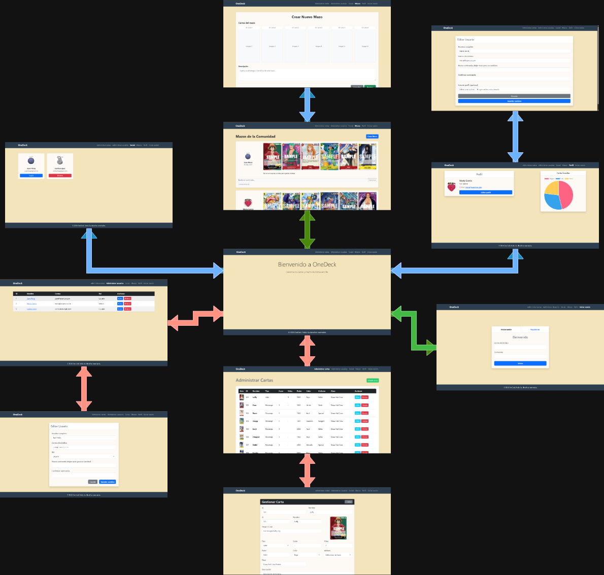
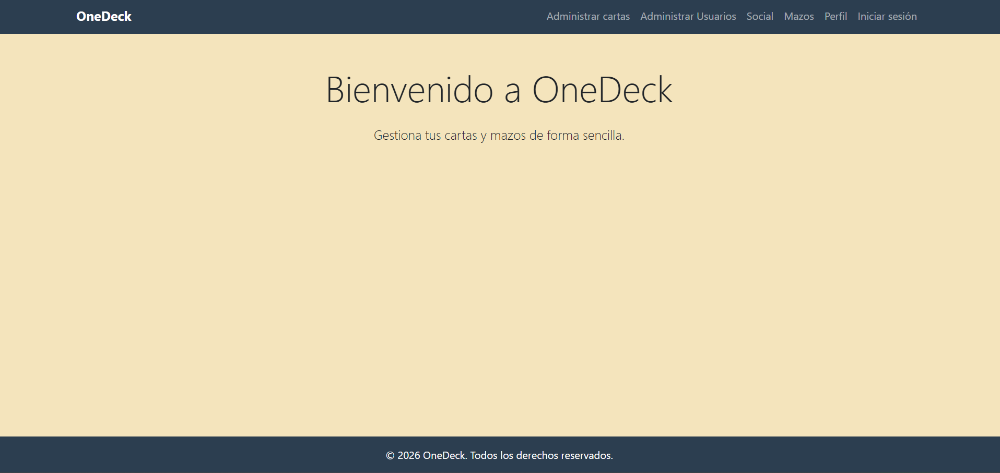
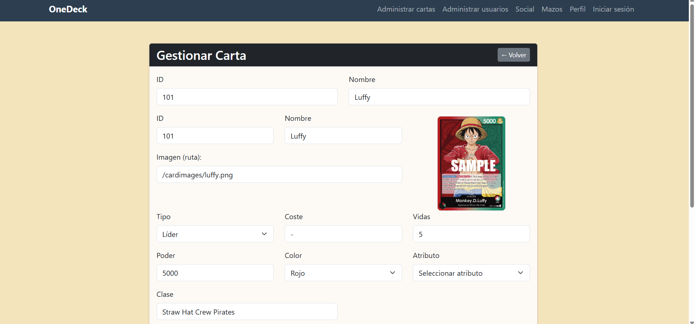
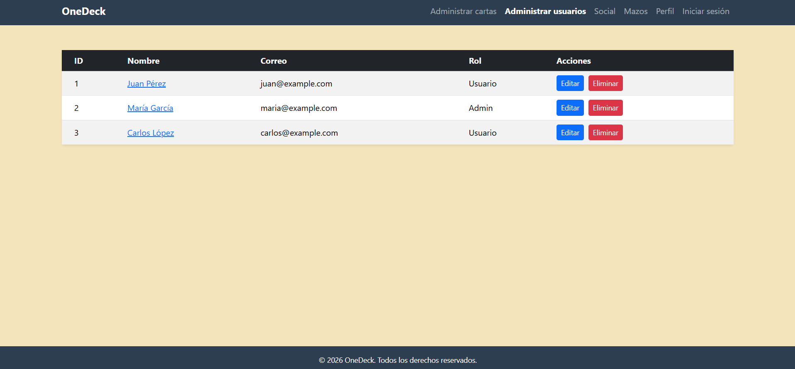
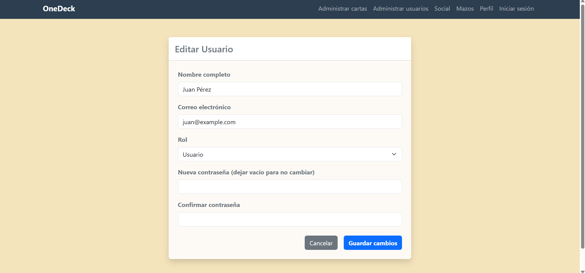
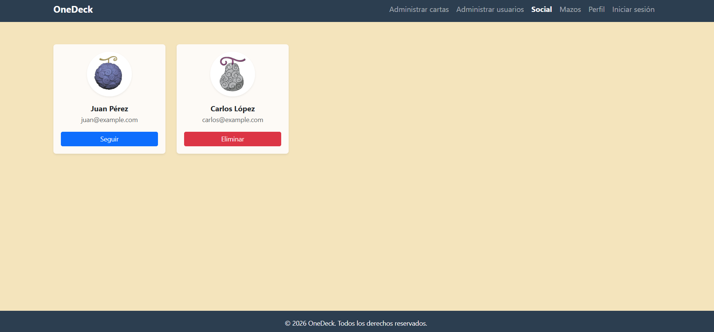
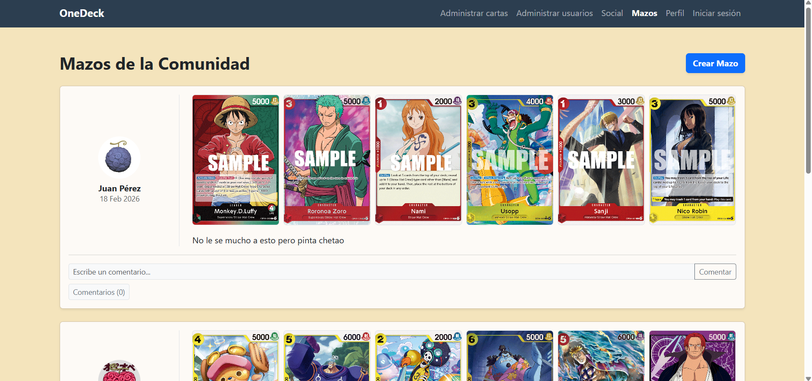
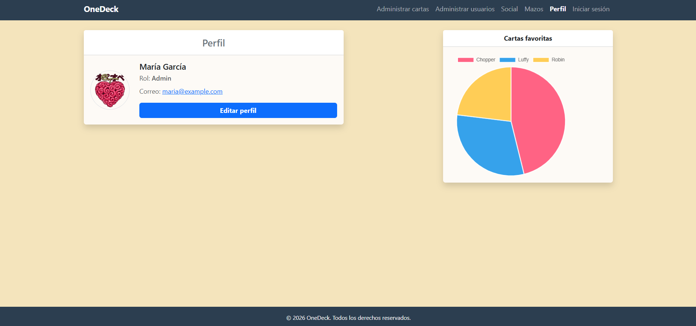
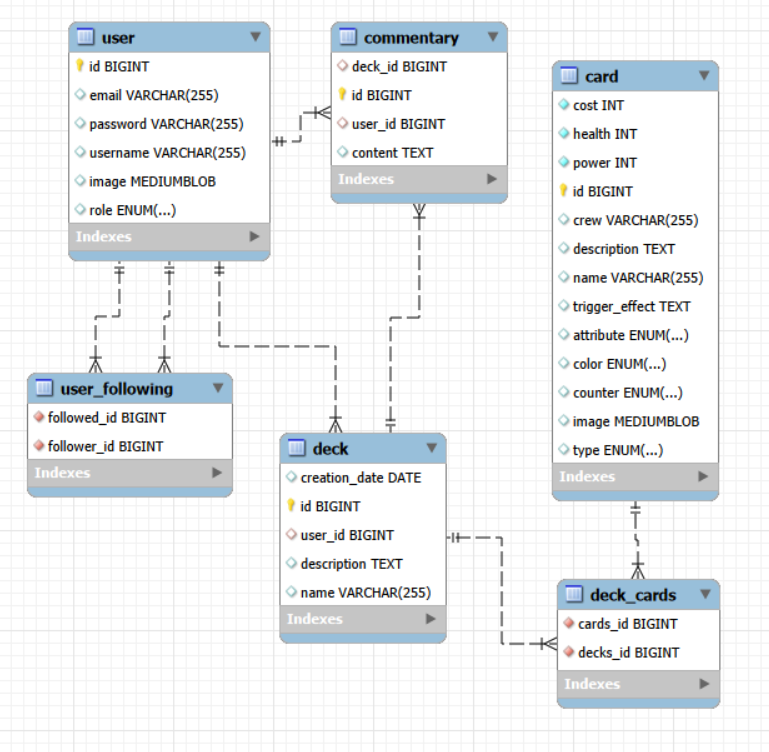
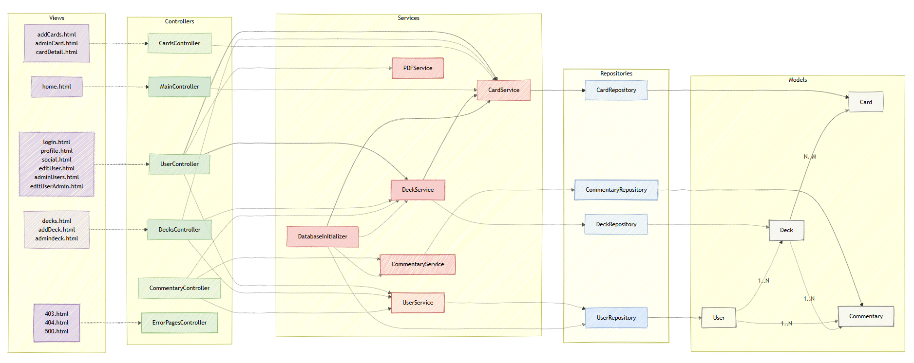

# OneDeck
## 👥 Miembros del Equipo
| Nombre y Apellidos | Correo URJC | Usuario GitHub |
|:--- |:--- |:--- |
| [Pablo León Molero] | p.leon.2019@alumnos.urjc.es | Pol1705 |
| [Aarón Fernández Lijó] | a.fernandezli.2020@alumnos.urjc.es | zZAiron |
| [Sergio Espinosa Robles] | s.espinosa.2020@alumnos.urjc.es | SergiOnLive3 |


---

## 🎭 **Preparación: Definición del Proyecto**

### **Descripción del Tema**
Nuestra pagina web consiste en un pequeño foro en el que cada usuario podrá crear mazos libremente para el TCG(Trading Card Game) de One Piece, permitiendo agregar amigos, y comentar sobre los mazos de otras personas, los administradores, podrán tambien añadir, editar y eliminar cartas de modo que pueda estar al dia de los cambios del juego real.

### **Entidades**
Indicar las entidades principales que gestionará la aplicación y las relaciones entre ellas:

1. Usuario
2. Mazo
3. Carta
4. Comentario

**Relaciones entre entidades:**
- Usuario - Mazo: Un usuario puede tener múltiples mazos (1:N)
- Mazo - Carta: Un mazo puede contener múltiples Cartas y una carta puede estar en múltiples Mazos (N:M)
- Mazo - Comentario: Un mazo puede tener multiples comentarios (N:1)
- Usuario - Usuario: Todos los usuarios podran tener amigos y podran verlos desde su pagina de perfil(N:M)

### **Permisos de los Usuarios**
Describir los permisos de cada tipo de usuario e indicar de qué entidades es dueño:

* **Usuario Anónimo**: 
  - Permisos: Unicamente podra navegar por la pagina a traves de la información pública, ver los mazos y comentarios posteados por la comunidad y visitar los perfiles de los usuarios. Podra registrarse para pasar a ser usuario registrado pero no podra postear ni comentar sobre mazos.
  - No es dueño de ninguna entidad

* **Usuario Registrado**: 
  - Permisos: Un usuario registrado tendrá todos los permisos de un usuario anónimo y además, podra agregar amistades, postear mazos, comentar sobre ellos y modificar su propio perfil.
  - Es dueño de su perfil, de sus mazos y sus comentarios.

* **Administrador**: 
  - Permisos: Todos los del usuario registrado y ademas, podrá moderar los post de la web independientemente de su dueño, permitiendo eliminar mazos o comentarios, tambien podra modificar las cartas, crearlas o (aun no decidido) eliminarlas, y finalmente, tendrá control absoluto sobre los usuarios de la web, permitiendo realizar cualquier cambio sobre el resto de usuarios que no sean tambien administradores.
  - Es dueño de las mismas entidades que el usuario registrado, cartas y resto de usuarios no administradores.

### **Imágenes**
Indicar qué entidades tendrán asociadas una o varias imágenes:

- **[Cartas]**: Una carta contiene una imagen que define su aspecto
- **[Usuario]**: Un usuario tendra una imagen asociada que servirá de foto de perfil.

### **Gráficos**
Indicar qué información se mostrará usando gráficos y de qué tipo serán:

- **Gráfico 1**: Cartas preferidas: Cada usuario tendrá en su perfil un gráfico radial que mostrará la proporción de uso de cartas en sus mazos, permitiendo asi ver cual/es son sus cartas preferidas.

### **Tecnología Complementaria**
Indicar qué tecnología complementaria se empleará:

- NO DECIDIDO TODAVIA
- [Ej: Envío de correos electrónicos automáticos mediante JavaMailSender]
- [Ej: Generación de PDFs de facturas usando iText o similar]

### **Algoritmo o Consulta Avanzada**
Indicar cuál será el algoritmo o consulta avanzada que se implementará:

- **Algoritmo/Consulta**: [Ej: Sistema de recomendaciones basado en el historial de compras del usuario]
- **Descripción**: [Ej: Analiza los productos comprados previamente y sugiere productos similares o complementarios utilizando filtrado colaborativo]
- **Alternativa**: [Ej: Consulta compleja que agrupe ventas por categoría, mes y región, con cálculo de tendencias]

---

## 🛠 **Práctica 1: Maquetación de páginas web con HTML y CSS**

### **Diagrama de Navegación**
Diagrama que muestra cómo se navega entre las diferentes páginas de la aplicación:



> [Descripción opcional del flujo de navegación: Ej: "El usuario puede acceder desde la página principal a todas las secciones mediante el menú de navegación. Los usuarios anónimos solo tienen acceso a las páginas públicas, mientras que los registrados pueden acceder a su perfil y panel de usuario."]

### **Capturas de Pantalla y Descripción de Páginas**

#### **1. Página Principal / Home**


> Pagina que unicamente da la bienvenida a la pagina, teniendo una barra superior que permite navegar a todas las distintas paginas.

#### **2. Página Registro / Login**


> Pagina que permite al usuario tanto iniciar sesion como registrarse, en funcion de las necesidades del usuario, solo se mostrará a usuarios no logueados.

#### **3. Página Gestion de Cartas / Add Cards**


> Esta pagina permitira a los usuarios administradores gestionar las cartas disponibles en la pagina, tanto crear como editar o eliminarlas.

#### **4. Página Edicion de Cartas / Admin Card**


> Esta pagina consiste en un formulario completo para poder editar cualquier campo de una carta que el administrador desee.

#### **5. Página Gestion de Usuarios / Admin Users**


> Esta pagina permitirá a los usuarios administradores gestionar a los usuarios registrados en la pagina para poder moderar o regular cualquier incidencia, pudiendo navegar a una pagina de edicion de usuario o eliminarlo por completo.

#### **6. Página Edicion de Usuarios / Edit User Admin**


> En esta pagina, el administrador dispondrá de un formulario para poder editar cualquier campo de un usuario registrado excepto la imagen(en estamos considerando permitirlo)

#### **7. Página Social / Social**


> En esta pagina, tanto usuarios registrados como no registrados, se podrá navegar por todos los perfiles de usuarios registrados, permitiendo a estos ultimos tambien agregar amistades para que aparezcan en un futuro en su feed del perfil

#### **8. Mazos de la Comunidad / Decks**


> Esta es la pagina de mayor actividad de la web, en ella todos los usuarios podrán ver los distintos mazos creados por los usuarios para probarlos si gustan en sus partidas y visitar los perfiles de los creadores de dichos mazos, ademas los usuarios registrados podrán acceder a la creación de mazos, eliminación de sus propios mazos y tendrán la posibilidad de comentar sobre los mazos posteados

#### **9. Pagina de Creacion de Mazos / Add Decks**


> En esta pagina los usuarios dispondrán de las herramientas necesarias para poder crear sus mazos personalizados para postearlos.

#### **10. Perfil / Profile**


> En esta pagina se podrá visualizar el perfil de los distintos usuarios, por ahora muestra un perfil estatico, en proximas entregas cargará el perfil que corresponda, permitiendo acceder a la edicion del perfil si es el del usuario logueado.

#### **11. Editar Perfil / Edit User**


> En esta pagina el usuario podra modificar cualquier campo de su perfil, incluida su foto de perfil, que será necesaria ya que al registrarse todos los perfiles tendrán una imagen por defecto.

### **Participación de Miembros en la Práctica 1**

#### **Alumno 1 - [Pablo León Molero]**

[Descripción de las tareas y responsabilidades principales del alumno en el proyecto]

| Nº    | Commits      | Files      |
|:------------: |:------------:| :------------:|
|1| [login, navbar,and footer added to all pages, en este commit puse las paginas que en ese momento vi necesarias y las conecte todas con un diseño simple](URL_commit_1)  | [Casi todos los archivos de ese momento]  |
|2| [added edit user and admin user añadi con completa funcionalidad estas paginas](URL_commit_2)  | [principalmente edit user y admin user](adminuser.html edituser.html)   |
|3| [add cards añadi la pagina add cards](URL_commit_3)  | [addcards](addcards.html)   |
|4| [Edit/Create Card añadi una pagina para crear o editar la entidad, el anterior commit solo mostraba el listado y navega aqui](URL_commit_4)  | [Archivo4](URL_archivo_4)   |
|5| [Fixes in profile and edituser ](URL_commit_5)  | [profile y edituser](profile.html edituser.html)   |

---

#### **Alumno 2 - [Nombre Completo]**

[Descripción de las tareas y responsabilidades principales del alumno en el proyecto]

| Nº    | Commits      | Files      |
|:------------: |:------------:| :------------:|
|1| [Descripción commit 1](URL_commit_1)  | [Archivo1](URL_archivo_1)   |
|2| [Descripción commit 2](URL_commit_2)  | [Archivo2](URL_archivo_2)   |
|3| [Descripción commit 3](URL_commit_3)  | [Archivo3](URL_archivo_3)   |
|4| [Descripción commit 4](URL_commit_4)  | [Archivo4](URL_archivo_4)   |
|5| [Descripción commit 5](URL_commit_5)  | [Archivo5](URL_archivo_5)   |

---

#### **Alumno 3 - Sergio Espinosa Robles**

Principalmente mis tareas fueron migrar los estilos de la pagina para usar Bootstrap y la realizacion de la pagina los mazos, el resto fueron tareas secundarias para complementar el trabajo.

| Nº    | Commits      | Files      |
|:------------: |:------------:| :------------:|
|1| [Este fue el primer commit "grande" que hice, en él, borre casi todo el contenido de  nuestro style.css para usar los estilos de Bootstrap](c20782651c241a5037403b98352f1872556bc942)  | [style.css](proyect\style.css)   |
|2| [En este commit añadi la logica de creacion de posts y comentarios, aunque todavia no se reflejen al no haber base de datos](49acde8a50cc66dea7948747dc10f290e2178450)  | [addDeck.html](proyect\addDeck.html)   |
|3| [Añadi una breve pagina para mostrar como se verá la pagina social a traves de la que agregar amistades y visitar perfiles](d29f8f2d57322e02589de0201627eb468f5779df)  | [social.html](proyect\social.html)   |
|4| [Decidimos cambiar la tematica de la pagina por lo que hubo que renombrarla, sin mayor importancia](398ed3023a9c2a93519d70e3d2bcc16bdd0abde9)  | [Sin archivo editado principal](*vacio)   |
|5| [Justo al inicio del proyecto un pequeño commit para probar los enlaces](7476fd0b7a3c155e9d6e4a462f4ffcd150e04408)  | [home.html](proyect\home.html)   |

---

## 🛠 **Práctica 2: Web con HTML generado en servidor**

### **Navegación y Capturas de Pantalla**

#### **Diagrama de Navegación**

Solo si ha cambiado.

#### **Capturas de Pantalla Actualizadas**

Solo si han cambiado.

### **Instrucciones de Ejecución**

#### **Requisitos Previos**
- **Java**: versión 21 o superior
- **Maven**: versión 3.8 o superior
- **MySQL**: versión 8.0 o superior
- **Git**: para clonar el repositorio

#### **Pasos para ejecutar la aplicación**

1. **Clonar el repositorio**
   ```bash
   git clone https://github.com/[usuario]/[nombre-repositorio].git
   cd [nombre-repositorio]
   ```

2. **AQUÍ INDICAR LO SIGUIENTES PASOS**

#### **Credenciales de prueba**
- **Usuario Admin**: usuario: `admin`, contraseña: `admin`
- **Usuario Registrado**: usuario: `user`, contraseña: `user`

### **Diagrama de Entidades de Base de Datos**

Diagrama mostrando las entidades, sus campos y relaciones:



> [Descripción opcional: Ej: "El diagrama muestra las 4 entidades principales: Usuario, Producto, Pedido y Categoría, con sus respectivos atributos y relaciones 1:N y N:M."]

### **Diagrama de Clases y Templates**

Diagrama de clases de la aplicación con diferenciación por colores o secciones:



> [Descripción opcional del diagrama y relaciones principales]

### **Participación de Miembros en la Práctica 2**

#### **Alumno 1 - [Nombre Completo]**

[Descripción de las tareas y responsabilidades principales del alumno en el proyecto]

| Nº    | Commits      | Files      |
|:------------: |:------------:| :------------:|
|1| [Descripción commit 1](URL_commit_1)  | [Archivo1](URL_archivo_1)   |
|2| [Descripción commit 2](URL_commit_2)  | [Archivo2](URL_archivo_2)   |
|3| [Descripción commit 3](URL_commit_3)  | [Archivo3](URL_archivo_3)   |
|4| [Descripción commit 4](URL_commit_4)  | [Archivo4](URL_archivo_4)   |
|5| [Descripción commit 5](URL_commit_5)  | [Archivo5](URL_archivo_5)   |

---

#### **Alumno 2 - [Nombre Completo]**

[Descripción de las tareas y responsabilidades principales del alumno en el proyecto]

| Nº    | Commits      | Files      |
|:------------: |:------------:| :------------:|
|1| [Descripción commit 1](URL_commit_1)  | [Archivo1](URL_archivo_1)   |
|2| [Descripción commit 2](URL_commit_2)  | [Archivo2](URL_archivo_2)   |
|3| [Descripción commit 3](URL_commit_3)  | [Archivo3](URL_archivo_3)   |
|4| [Descripción commit 4](URL_commit_4)  | [Archivo4](URL_archivo_4)   |
|5| [Descripción commit 5](URL_commit_5)  | [Archivo5](URL_archivo_5)   |

---

#### **Alumno 3 - [Nombre Completo]**

[Descripción de las tareas y responsabilidades principales del alumno en el proyecto]

| Nº    | Commits      | Files      |
|:------------: |:------------:| :------------:|
|1| [Descripción commit 1](URL_commit_1)  | [Archivo1](URL_archivo_1)   |
|2| [Descripción commit 2](URL_commit_2)  | [Archivo2](URL_archivo_2)   |
|3| [Descripción commit 3](URL_commit_3)  | [Archivo3](URL_archivo_3)   |
|4| [Descripción commit 4](URL_commit_4)  | [Archivo4](URL_archivo_4)   |
|5| [Descripción commit 5](URL_commit_5)  | [Archivo5](URL_archivo_5)   |

---

#### **Alumno 4 - [Nombre Completo]**

[Descripción de las tareas y responsabilidades principales del alumno en el proyecto]

| Nº    | Commits      | Files      |
|:------------: |:------------:| :------------:|
|1| [Descripción commit 1](URL_commit_1)  | [Archivo1](URL_archivo_1)   |
|2| [Descripción commit 2](URL_commit_2)  | [Archivo2](URL_archivo_2)   |
|3| [Descripción commit 3](URL_commit_3)  | [Archivo3](URL_archivo_3)   |
|4| [Descripción commit 4](URL_commit_4)  | [Archivo4](URL_archivo_4)   |
|5| [Descripción commit 5](URL_commit_5)  | [Archivo5](URL_archivo_5)   |

---

## 🛠 **Práctica 3: API REST, docker y despliegue**

### **Documentación de la API REST**

#### **Especificación OpenAPI**
📄 **[Especificación OpenAPI (YAML)](/api-docs/api-docs.yaml)**

#### **Documentación HTML**
📖 **[Documentación API REST (HTML)](https://raw.githack.com/[usuario]/[repositorio]/main/api-docs/api-docs.html)**

> La documentación de la API REST se encuentra en la carpeta `/api-docs` del repositorio. Se ha generado automáticamente con SpringDoc a partir de las anotaciones en el código Java.

### **Diagrama de Clases y Templates Actualizado**

Diagrama actualizado incluyendo los @RestController y su relación con los @Service compartidos:


### **Instrucciones de Ejecución con Docker**

#### **Requisitos previos:**
- Docker instalado (versión 20.10 o superior)
- Docker Compose instalado (versión 2.0 o superior)

#### **Pasos para ejecutar con docker-compose:**

1. **Clonar el repositorio** (si no lo has hecho ya):
   ```bash
   git clone https://github.com/[usuario]/[repositorio].git
   cd [repositorio]
   ```

2. **AQUÍ LOS SIGUIENTES PASOS**:

### **Construcción de la Imagen Docker**

#### **Requisitos:**
- Docker instalado en el sistema

#### **Pasos para construir y publicar la imagen:**

1. **Navegar al directorio de Docker**:
   ```bash
   cd docker
   ```

2. **AQUÍ LOS SIGUIENTES PASOS**

### **Despliegue en Máquina Virtual**

#### **Requisitos:**
- Acceso a la máquina virtual (SSH)
- Clave privada para autenticación
- Conexión a la red correspondiente o VPN configurada

#### **Pasos para desplegar:**

1. **Conectar a la máquina virtual**:
   ```bash
   ssh -i [ruta/a/clave.key] [usuario]@[IP-o-dominio-VM]
   ```
   
   Ejemplo:
   ```bash
   ssh -i ssh-keys/app.key vmuser@10.100.139.XXX
   ```

2. **AQUÍ LOS SIGUIENTES PASOS**:

### **URL de la Aplicación Desplegada**

🌐 **URL de acceso**: `https://[nombre-app].etsii.urjc.es:8443`

#### **Credenciales de Usuarios de Ejemplo**

| Rol | Usuario | Contraseña |
|:---|:---|:---|
| Administrador | admin | admin123 |
| Usuario Registrado | user1 | user123 |
| Usuario Registrado | user2 | user123 |

### **OTRA DOCUMENTACIÓN ADICIONAL REQUERIDA EN LA PRÁCTICA**

### **Participación de Miembros en la Práctica 3**

#### **Alumno 1 - [Nombre Completo]**

[Descripción de las tareas y responsabilidades principales del alumno en el proyecto]

| Nº    | Commits      | Files      |
|:------------: |:------------:| :------------:|
|1| [Descripción commit 1](URL_commit_1)  | [Archivo1](URL_archivo_1)   |
|2| [Descripción commit 2](URL_commit_2)  | [Archivo2](URL_archivo_2)   |
|3| [Descripción commit 3](URL_commit_3)  | [Archivo3](URL_archivo_3)   |
|4| [Descripción commit 4](URL_commit_4)  | [Archivo4](URL_archivo_4)   |
|5| [Descripción commit 5](URL_commit_5)  | [Archivo5](URL_archivo_5)   |

---

#### **Alumno 2 - [Nombre Completo]**

[Descripción de las tareas y responsabilidades principales del alumno en el proyecto]

| Nº    | Commits      | Files      |
|:------------: |:------------:| :------------:|
|1| [Descripción commit 1](URL_commit_1)  | [Archivo1](URL_archivo_1)   |
|2| [Descripción commit 2](URL_commit_2)  | [Archivo2](URL_archivo_2)   |
|3| [Descripción commit 3](URL_commit_3)  | [Archivo3](URL_archivo_3)   |
|4| [Descripción commit 4](URL_commit_4)  | [Archivo4](URL_archivo_4)   |
|5| [Descripción commit 5](URL_commit_5)  | [Archivo5](URL_archivo_5)   |

---

#### **Alumno 3 - [Nombre Completo]**

[Descripción de las tareas y responsabilidades principales del alumno en el proyecto]

| Nº    | Commits      | Files      |
|:------------: |:------------:| :------------:|
|1| [Descripción commit 1](URL_commit_1)  | [Archivo1](URL_archivo_1)   |
|2| [Descripción commit 2](URL_commit_2)  | [Archivo2](URL_archivo_2)   |
|3| [Descripción commit 3](URL_commit_3)  | [Archivo3](URL_archivo_3)   |
|4| [Descripción commit 4](URL_commit_4)  | [Archivo4](URL_archivo_4)   |
|5| [Descripción commit 5](URL_commit_5)  | [Archivo5](URL_archivo_5)   |

---

#### **Alumno 4 - [Nombre Completo]**

[Descripción de las tareas y responsabilidades principales del alumno en el proyecto]

| Nº    | Commits      | Files      |
|:------------: |:------------:| :------------:|
|1| [Descripción commit 1](URL_commit_1)  | [Archivo1](URL_archivo_1)   |
|2| [Descripción commit 2](URL_commit_2)  | [Archivo2](URL_archivo_2)   |
|3| [Descripción commit 3](URL_commit_3)  | [Archivo3](URL_archivo_3)   |
|4| [Descripción commit 4](URL_commit_4)  | [Archivo4](URL_archivo_4)   |
|5| [Descripción commit 5](URL_commit_5)  | [Archivo5](URL_archivo_5)   |

---
